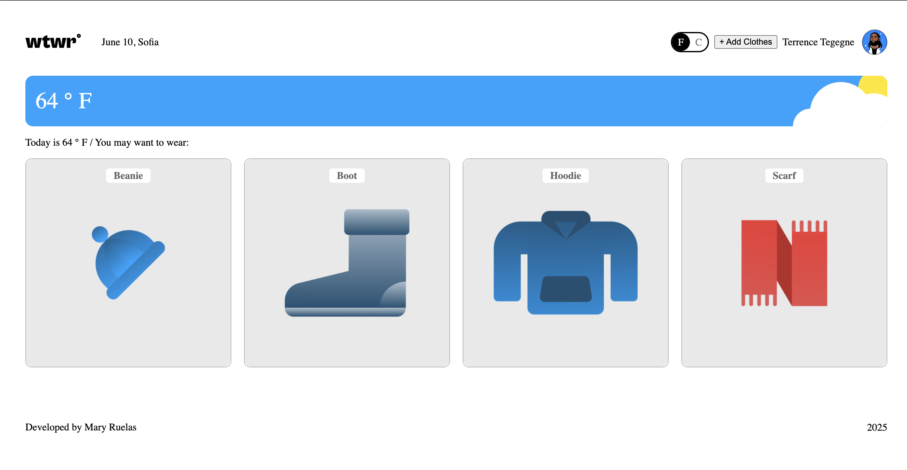
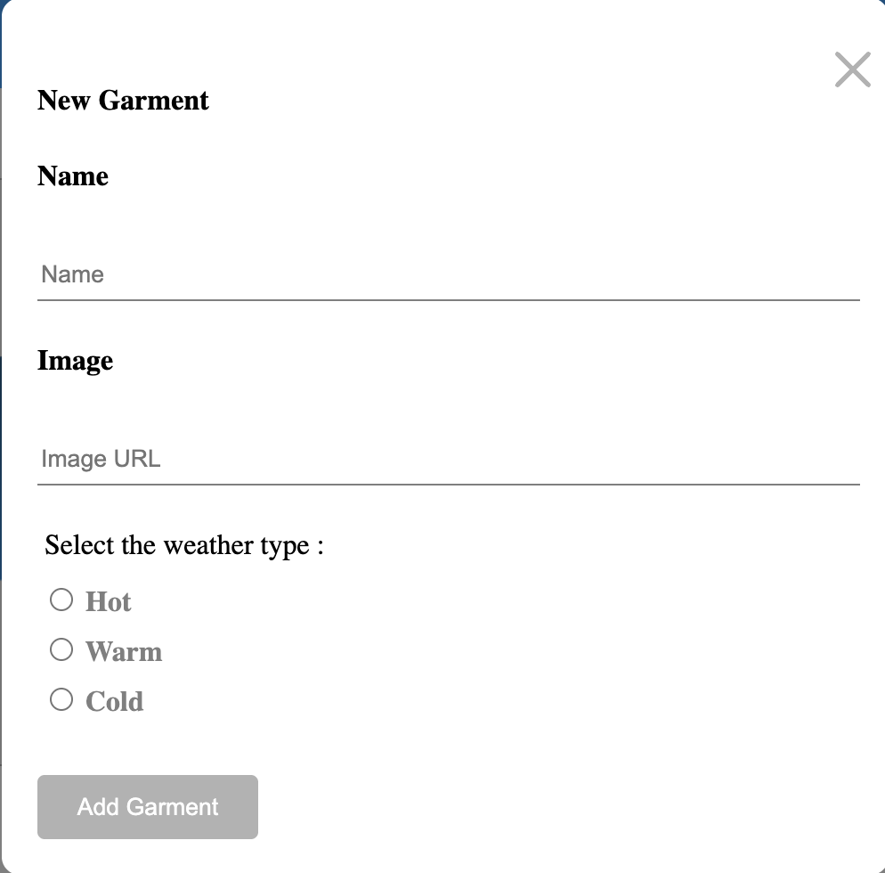
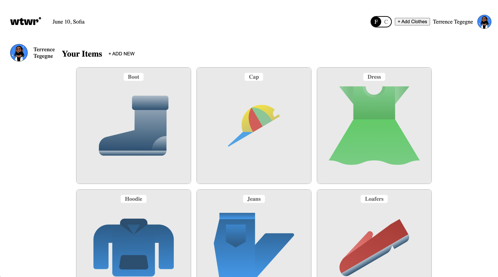

# SE Project React

## Backend Repository

If you have a separate backend (API) repository, add its public GitHub URL here. Automated reviewers require this link.

Replace the placeholder below with your backend repo URL:

[https://github.com/MaryAllie2006/se_project_express.git]

## Project Description

This project is a React application built with Vite that allows users to manage a virtual wardrobe. Users can add, view, and delete garments, each with a name, photo, and weather suitability. The app features modals for adding and deleting items, a profile section, and responsive UI components.

## Technologies and Techniques Used

- **React** for building user interfaces
- **Vite** for fast development and build tooling
- **React Router** for client-side routing
- **CSS Flexbox** for responsive layouts
- **Fetch API** for backend communication
- **ESLint** for code quality
- **Context API** for state management

## Features

- Add new garments with name, image, and weather suitability
- View all garments in a card layout
- Delete garments with confirmation modals
- Responsive design for desktop and mobile
- Profile section with user avatar and garment list

## Screenshots

---

This template provides a minimal setup to get React working in Vite with HMR and some ESLint rules.

Currently, two official plugins are available:

- [@vitejs/plugin-react](https://github.com/vitejs/vite-plugin-react/blob/main/packages/plugin-react/README.md) uses [Babel](https://babeljs.io/) for Fast Refresh
- [@vitejs/plugin-react-swc](https://github.com/vitejs/vite-plugin-react-swc) uses [SWC](https://swc.rs/) for Fast Refresh